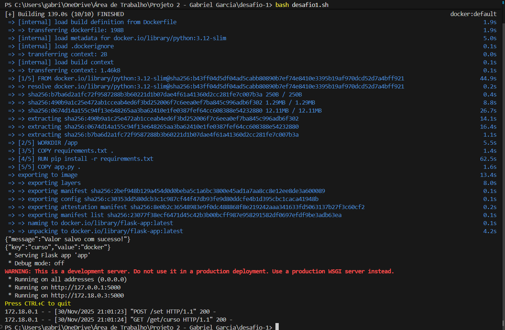
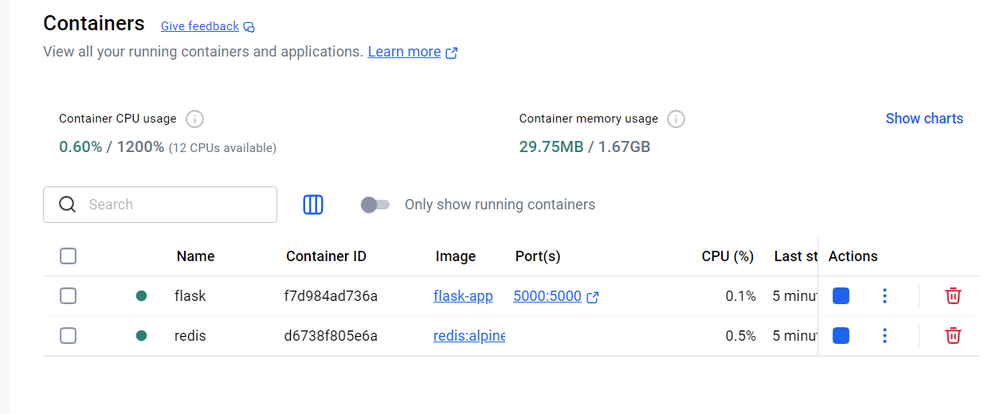
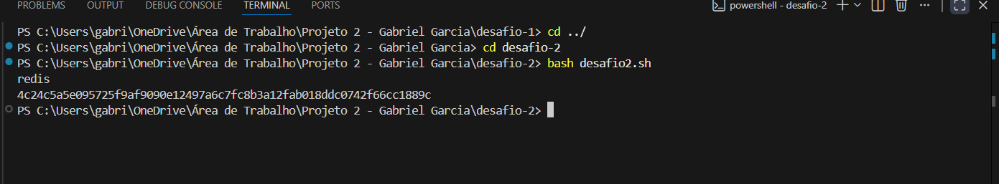
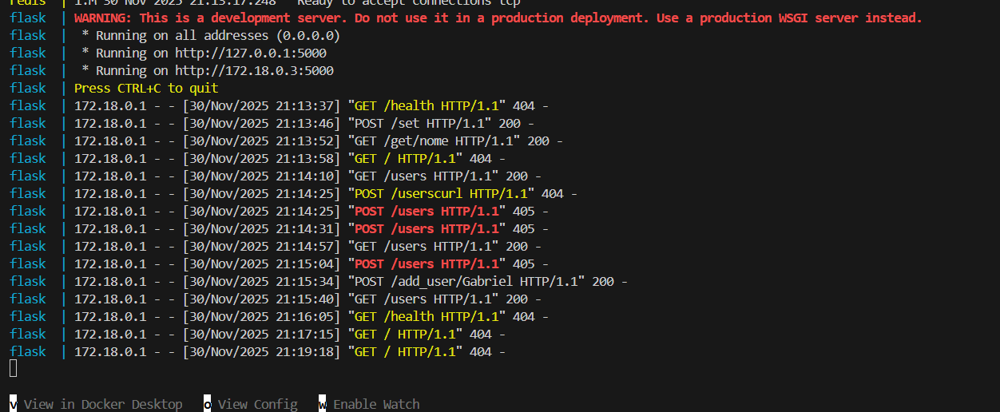
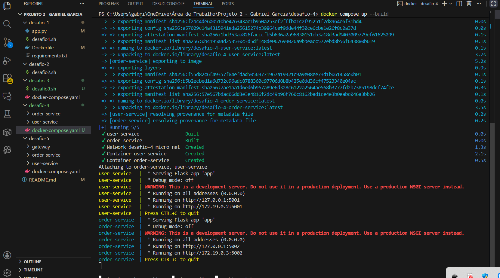
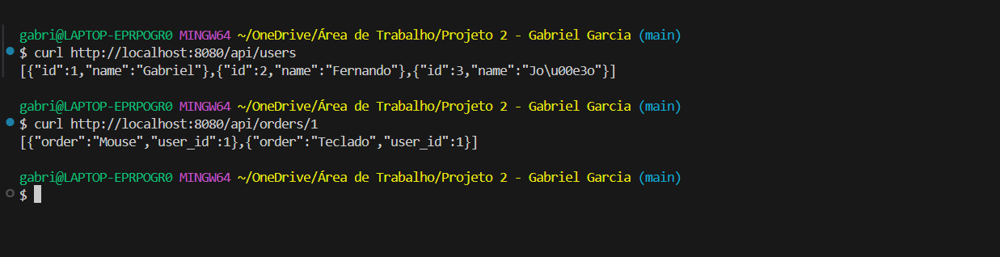
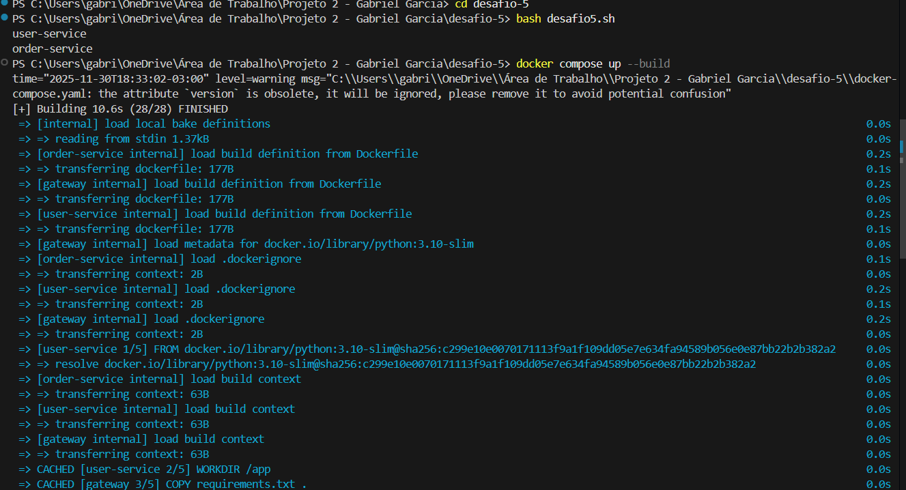
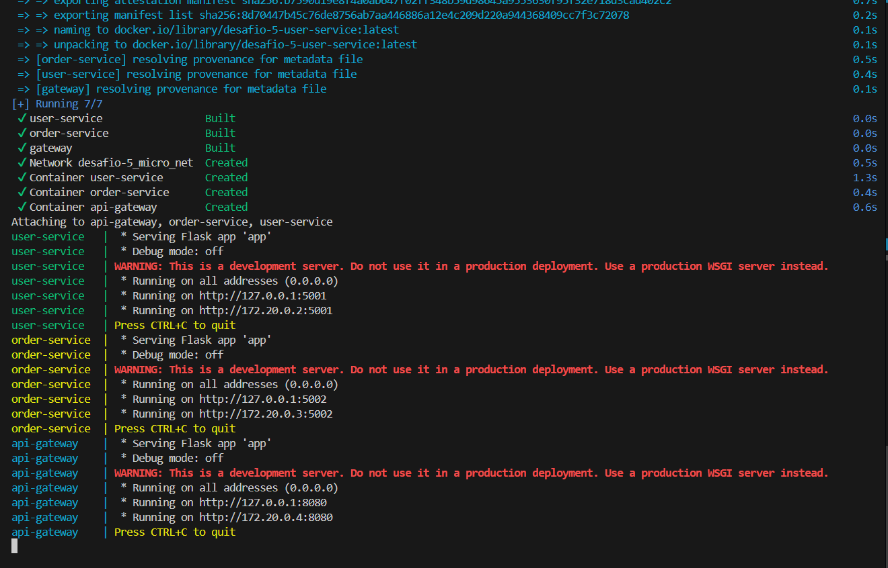

# 🐳 **Trabalho – Docker e Microsserviços**

**Aluno:** Gabriel Garcia
**Disciplina:** Fundamentos de Computação Concorrente, Paralela e Distribuída

---

# 📌 **Visão Geral do Projeto**

Este repositório contém a implementação dos **5 desafios obrigatórios**, envolvendo:

* Containers Docker
* Comunicação entre containers
* Volumes e persistência
* Docker Compose
* Microsserviços com e sem API Gateway

## 📁 Estrutura do Projeto

```

├── PROJETO 2 - Gabriel Garcia/

/desafio-1
│
├── app.py
├── desafio1.sh
├── Dockerfile
├── requirements.txt

desafio-2/
│
├── desafio2.sh
   
desafio-3/
│
├── docker-compose.yaml 

/desafio-4/
│
├── gateway/
│   ├── app.py
│   ├── Dockerfile
│   ├── requirements.txt
│
├── order_service/
│   ├── app.py
│   ├── Dockerfile
│   ├── requirements.txt
│
├── user_service/
│   ├── app.py
│   ├── Dockerfile
│   ├── requirements.txt
│
├── docker-compose.yaml
└── README.md


/desafio-5/
│
├── order_service/
│   ├── app.py
│   ├── Dockerfile
│   ├── requirements.txt
│
├── user_service/
│   ├── app.py
│   ├── Dockerfile
│   ├── requirements.txt
│
├── docker-compose.yaml
└── README.md


├── docker-compose.yaml
├── README.md
```

O objetivo é demonstrar domínio de Docker, redes, microsserviços e boas práticas de arquitetura distribuída.

---

# 🧩 **Desafio 1 — Containers em Rede**

## 📘 Objetivo

Criar **dois containers** que se comunicam via **rede Docker customizada**:

* **Container A:** Servidor web (Flask) na porta **5000**
* **Container B:** Faz requisições periódicas (curl em loop)

## 🏗️ Arquitetura

* Rede criada: `flask_redis_net`
* Logs exibem a comunicação entre eles

## ▶️ Como executar

```bash
cd desafio-1
bash desafio1.sh
```
O script sobe os containers conectados na mesma rede, além de demonstrar os logs do flask.



---

# 🧩 **Desafio 2 — Volumes e Persistência**

## 📘 Objetivo

Demonstrar persistência com **volumes Docker** utilizando **Redis**.

## 🏗️ Arquitetura

* Container roda um app Flask que grava dados em `Redis`.
* O volume externo mantém o arquivo mesmo após remover o container.

```
volume: redis_data:/data redis:alpine
```

## ▶️ Como executar

```bash
cd desafio-2
bash desafio2.sh
```

## 🧪 Testes

Salvar um usuário:

```bash
curl -X POST -H "Content-Type: application/json" \
    -d '{"key":"nome", "value":"Gabriel"}' \
    http://localhost:5000/set
```

Pegar o usuário:
```bash
curl http://localhost:5000/get/nome
```

---



# 🧩 **Desafio 3 — Docker Compose Orquestrando Serviços**

## 📘 Objetivo

Criar uma aplicação com 3 serviços:

* **Web** (Flask)
* **DB** (SQLite)
* **Cache** (Redis)

## 🏗️ Arquitetura

* Todos os serviços dentro da rede `flask_redis_net`
* Uso de variáveis de ambiente
* `depends_on` para ordem de inicialização

## ▶️ Como rodar

```bash
cd desafio-3
docker rm -f flask redis
docker network rm flask_redis_net
docker compose up --build
```

## 🧪 Testes

Listar usuários:

- Verifica se todos os comandos estão funcionandos:
> docker ps

- Testando o Redis (Cache):
(Salvando um valor no Redis via Flask)
> curl -X POST -H "Content-Type: application/json" \
-d '{"key":"nome", "value":"Gabriel"}' \
http://localhost:5000/set

(Buscando o valor)
> curl http://localhost:5000/get/nome

- Testando o SQLITE
(Criando o usuário)
> curl -X POST -H "Content-Type: application/json" \
-d '{"name":"Gabriel", "age":22}' \
http://localhost:5000/add_nome/nome

(Listar usuários)
> curl http://localhost:5000/users


---

# 🧩 **Desafio 4 — Microsserviços Independentes**

## 📘 Objetivo

Criar dois microsserviços independentes:

### **User Service**

Retorna lista de usuários:

```
GET /servico/users
GET /servico/users/<id>
```

### **Order Service**

Consome o User Service antes de retornar pedidos:

```
GET /servico/orders/<user_id>
```

## 🏗️ Arquitetura

* Cada microsserviço possui **Dockerfile próprio**
* Comunicação interna via HTTP usando nomes dos containers (DNS do Docker)

Ex:

```
http://user-service:5001/servico/users
```

## ▶️ Como executar

```bash
cd desafio-4
docker-compose up --build
```

## 🧪 Testes

Listar usuários:

```bash
curl http://localhost:5001/servico/users
```

Pedidos do usuário 1:

```bash
curl http://localhost:5002/servico/orders/1
```


---


# 🧩 **Desafio 5 — Microsserviços com API Gateway**

## 📘 Objetivo

Criar uma arquitetura com gateway centralizando o acesso aos dois microserviços.

### **Componentes**

| Serviço       | Função                           | Porta |
| ------------- | -------------------------------- | ----- |
| User Service  | Retorna usuários                 | 5001  |
| Order Service | Retorna pedidos + valida usuário | 5002  |
| API Gateway   | Ponto único de entrada           | 8080  |

## 🏗️ Arquitetura

```
Cliente → Gateway → user-service
                    → order-service
```

O cliente **NÃO acessa diretamente** os microsserviços.

O gateway expõe:

```
GET /api/users
GET /api/orders/<user_id>
```

E ele redireciona internamente:

* `/api/users` → `http://user-service:5001/servico/users`
* `/api/orders/1` → `http://order-service:5002/servico/orders/1`

## ▶️ Como rodar

```bash
cd desafio-5
docker compose up --build
```

## 🧪 Testes

Listar usuários:

```bash
- Utilizar terminal bash
curl http://localhost:8080/api/users
```

Pedidos:

```bash
- Utilizar terminal bash
curl http://localhost:8080/api/orders/1
```



---